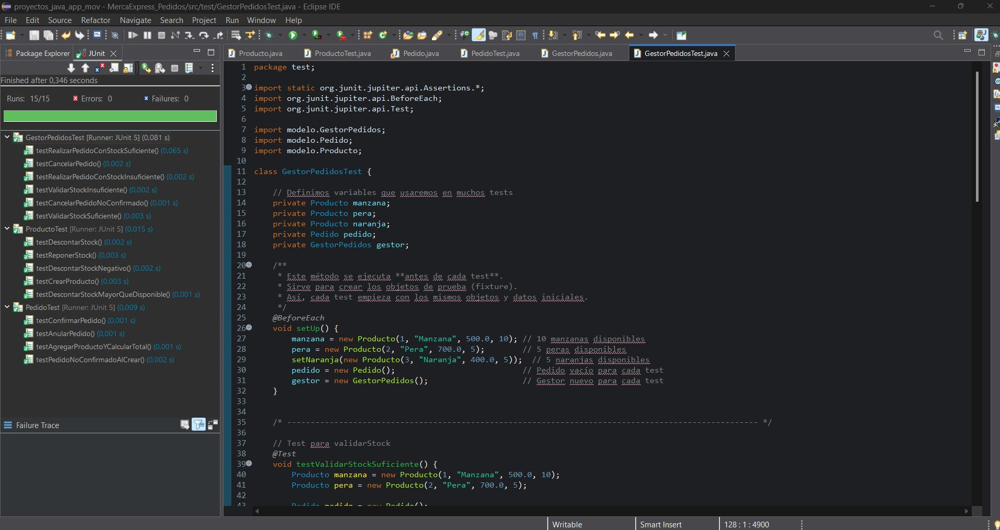
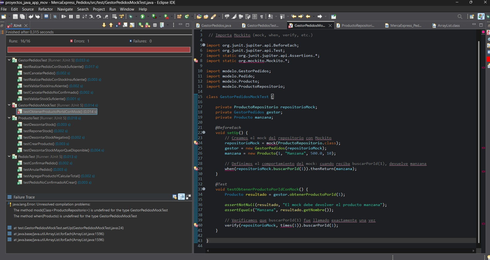
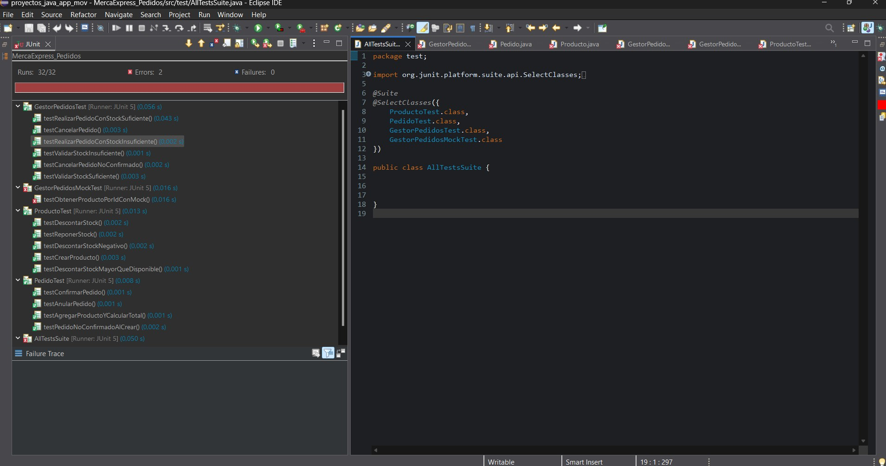

**_<h1 align="center">:vulcan_salute: Pruebas Unitarias Proyecto MercaExpress Pedidos :computer:</h1>_**

**<h3>:blue_book: Contexto:</h3>**

- Tu equipo de desarrollo ha sido contratado por MercaExpress, una plataforma emergente de comercio electrónico, para asegurar la calidad del software que gestiona los pedidos realizados por los usuarios.
- El sistema está creciendo rápidamente, y la empresa ha tenido problemas en producción debido a errores no detectados en sus servicios básicos.
- El desafío es aplicar una estrategia de pruebas unitarias estructurada utilizando JUnit, que permita cubrir de forma automatizada los componentes esenciales del sistema. Además, se espera que se construya la suite de pruebas siguiendo principios de Desarrollo Dirigido por Pruebas (TDD).

**<h3>:orange_book: Objetivo de Aprendizaje:</h3>**

- Implementar una suite de pruebas unitarias en Java utilizando JUnit, incluyendo fixtures, mocks y estructuras de test agrupadas, para validar el correcto funcionamiento de una pieza de software de baja a mediana complejidad, aplicando fundamentos de pruebas unitarias y buenas prácticas de diseño de test.

**<h3>:green_book: Requerimientos Específicos:</h3>**

1. Software base a testear
- Desarrollar una pieza de software que represente parte del sistema de pedidos. Debe contener:
- Clase Producto con atributos: id, nombre, precio, stockDisponible.
- Clase Pedido con una lista de productos y métodos como:
  - agregarProducto(Producto producto, int cantidad)
  - calcularTotal()
  - confirmarPedido()
- Clase GestorPedidos con lógica de negocio:
  - realizarPedido(Pedido pedido)
  - cancelarPedido(Pedido pedido)
  - validarStock(Pedido pedido)

2. Creación de pruebas unitarias con JUnit
- Integrar JUnit 5 en el proyecto (puede ser en Eclipse o IntelliJ).
- Crear clases de prueba separadas para cada clase del sistema (ProductoTest, PedidoTest, GestorPedidosTest).
- Usar anotaciones estándar de JUnit (@Test, @BeforeEach, @AfterEach, etc.).
- Incluir casos de prueba con aserciones múltiples (assertEquals, assertThrows, etc.).

3. Uso de Fixtures
- Preparar objetos comunes (productos de prueba, pedidos predefinidos) usando @BeforeEach para evitar duplicación de código.

4. Uso de Mocks
- Simular el comportamiento de un repositorio o fuente de datos usando un mock (puede ser con Mockito o usando una clase auxiliar).
- Verificar interacciones entre clases (verify, when...thenReturn).

5. Creación de una Suite de Pruebas
- Organizar todos los casos en una suite de pruebas unificada usando @Suite y @SelectClasses.

6. Aplicación de TDD (Test Driven Development)
- Documentar al menos un componente de la solución que haya sido desarrollado siguiendo TDD: primero escribir el test que falla, luego el código que lo hace pasar, luego refactorizar.
- Incluir evidencia (capturas o comentarios en el código) del ciclo Red – Green – Refactor.

7. Reflexión sobre pruebas unitarias
- Incluir una reflexión escrita que responda:
  - ¿Qué ventajas observaron al implementar pruebas unitarias?
  - ¿Qué limitaciones detectaron?
  - ¿Qué beneficios ofreció aplicar TDD?
  - ¿Cómo podrían escalar la solución para incluir pruebas de integración?

**<h3>:blue_book: Entregables:</h3>**

- Proyecto Java completo, que incluya:
  - Código funcional del sistema de pedidos.
  - Carpeta /test con todas las clases de prueba implementadas.
  - Fixture configurado correctamente.
  - Uso de mocks verificado en al menos una clase.
  - Suite de pruebas ejecutable.

**<h3>:orange_book: Estructura del Proyecto:</h3>**
```plaintext
src/
├── modelo/
│     ├── GestorPedidos.java
│     ├── Pedido.java
│     ├── Producto.java
│     └── ProductoRepositorio.java
└── test/
  ├── GestorPedidosTest.java
      ├── GestorPedidosMockTest.java
      ├── PedidoTest.java
      ├── ProductoTest.java
      └── AllTestsSuite.java 
```

**<h3>:book: Ejemplo de Salida:</h3>**

- Uso de Fixtures


- Uso de Mocks


- Creación de una Suite de Pruebas
